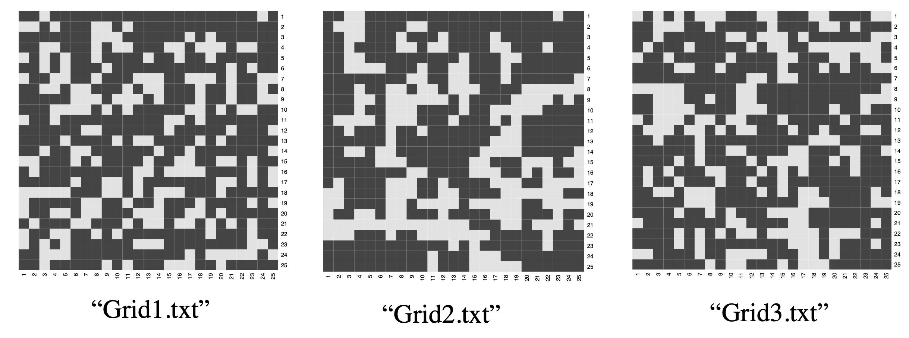

# moran-statistics
Using a moran's statistics to to hypothesis tests to judge whether a grid is random or not

## Introduction

Consider the following grid image. Which one do you think is completely random? We can not make our decisions simply based from our eyes. But we can do have to formuate a statistical approach to get the conclusion. I found this statistic by the inspiration of how to calculate metric like pearson's correlation coefficient and some concepts about spatial statistics. After some searches, I reached the moran's I statistic.  

## The result
According to the result, Grid 1 is random, grid 2 and grid 3 is not!
see the details at [here](https://raw.githack.com/yungson/moran-statistics/main/moran-stats.html)

